**Аннотация**

Данная программа предназначена для сопровождения научно-технических программ в вузах РФ: дополнение, обработка, анализ и хранение нужной информации.

Результатом данной программы является просматривание, фильтрация и анализ данных, сохранение полученной информации в отчёт, выдача распоряжения финансирования.

# **Оглавление**

0. [Введение](#introduction)
1. [Техническое задание на разработку	](#тз)
2. [Проект информационной системы](#пис)
3. [Документация информационной системы](#док)
   1. [Краткое описание и назначение системы](#кроп)
   2. [Руководство пользователя](#рукп)
   3. [Руководство администратора системы](#рукад)
4. [Демонстрация работы](#демо)
5. [Заключение](#закл)
6. [Список использованных источников](#ист)

# **Введение** 
Данное приложение предназначено для сопровождения научно-технических программ. Эта область требуют обработки больших объемов информации при сохранении её целостности. В работе используются данные о вузах, НИР и НТП. Такие данные структурированы и представлены в виде таблицы. Для формирования такого рода данных целесообразно использовать информационную систему, которая будет удовлетворять функциональным требованиям.

Приложение позволяет осуществлять взаимодействие с данными, выпускать распоряжения, формировать отчетные документы.

Документ содержит разделы о техническом задании на разработку, о проекте информационной системы, о документации информационной системы, о результатах испытания системы.

# **Техническое задание на разработку**
#
**Объект** информационной технологии:  сопровождение научно-технических программ (НТП).

Цель разработки: создание программных средств, обеспечивающих ввод, хранение и обработку данных о проектах/НИР, выполняемых по научно-техническим программам, реализация функций сопровождения НТП.

**Информационный  базис**:  данные о проектах/НИР,  выполняемых по научно-техническим программам, данные о научно-технических программах, данные о вузах.

**Научно-технические программы** - форма организации и финансирования научной (научно-технической) деятельности,  направленная на выполнение целевых исследований и разработок в заданной  области

**Требования к разработке приложения**  для  обработки  и  анализа данных.

Приложение должно реализовывать следующие функции:

а) контроль и восстановление целостности баз данных системы; формирование данных в таблице по финансированию вузов;

б) просмотр информации о тематических планах и о финансировании вузов, фильтрация и упорядочивание информации при просмотре, добавление и редактирование информации, обеспечение целостности данных;

в) реализация отчетных (табличных) форм распределения НИР по вузам, по рубрикам ГРНТИ (с учетом первого и второго кода, если второй есть), по характеру НИР, с сохранением условий фильтрации информации, заданных при просмотре; формирование документов;

г) реализация функции выпуска распоряжения по поквартальному финансированию вузов в виде документа.

# **Проект информационной системы** 
## **Основные функции информационной системы** 
## Основными функциями информационной системы являются: 
- Отображение данных: Таблицы с информацией о НИР, НТП и  вузах.
- Операции с таблицей с информацией о НИР:
  - Сортировка данных
  - Фильтрация данных по программе и местоположению	
  - Добавление и редактирование записей
    - Проверка целостности вносимых данных
    - Выделение добавленной/редактируемой записи в таблице
  - Удаление записей
    - Запрос на подтверждение удаления
- Просмотр форм анализа данных 
  - Применение условий фильтрации к анализируемым данным
  - Сохранение отчетных документов с отображением условий фильтрации
- Выпуск распоряжения по поквартальному финансированию вузов.
  - Расчет финансирования для каждого вуза
  - Сохранение распоряжения в документ 

## **Информационная структура системы.**
Исходные таблицы: **vuz** (данные о вузах), **ntp\_prog** (данные о программах), **ntp\_proj** (данные о НИР).

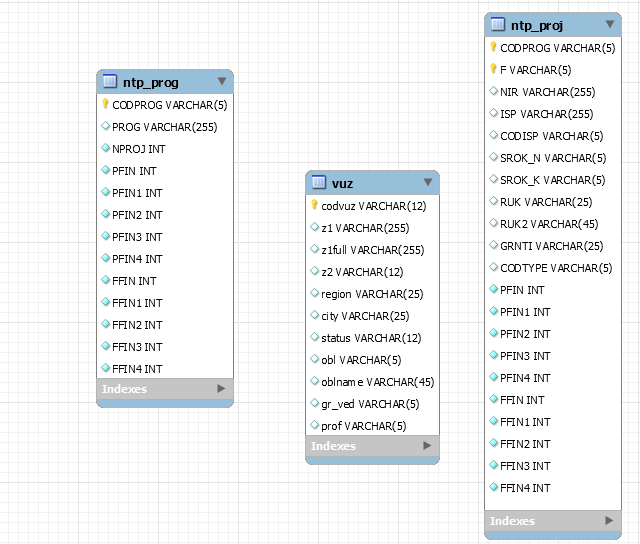

Рис. 2 Иллюстрация информационной структуры системы.

Таблица **vuz**

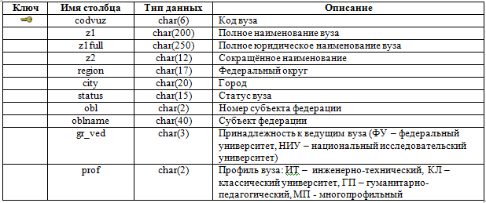

Таблица **ntp\_proj**

|**Ключ**|**Имя столбца**|**Тип данных**|**Описание**|
| :-: | :-: | :-: | :-: |
|+|CODPROG|char(5)|Код НТП|
|+|F|char(5)|Номер проекта|
||NIR|char(255)|Наименование проекта|
||ISP|char(255)|Организация-исполнитель проекта|
||CODISP|char(5)|Код организации-исполнителя|
||SROK\_N|char(5)|Начало срока выполнения проекта|
||SROK\_K|char(5)|Окончание срока выполнения проекта|
||RUK|char(25)|Руководитель проекта|
||RUK2|char(45)|Должность, ученая степень, ученое звание руководителя|
||GRNTI|char(25)|Код ГРНТИ проекта|
||CODTYPE|char(5)|Характер проекта|
||PFIN|Int|Плановое финансирование текущего года|
||PFIN1|Int|Плановое финансирование 1-го квартала|
||PFIN2|Int|Плановое финансирование 2-го квартала|
||PFIN3|Int|Плановое финансирование 3-го квартала|
||PFIN4|Int|Плановое финансирование 4-го квартала|
||FFIN|Int|Фактическое финансирование текущего года|
||FFIN1|Int|Фактическое финансирование 1-го квартала|
||FFIN2|Int|Фактическое финансирование 2-го квартала|
||FFIN3|Int|Фактическое финансирование 3-го квартала|
||FFIN4|Int|Фактическое финансирование 4-го квартала|

Таблица **ntp\_prog.**

|**Ключ**|**Имя столбца**|**Тип данных**|**Описание**|
| :-: | :-: | :-: | :-: |
|+|CODPROG|char(5)|Код НТП|
||PROG|char(255)|Название программы|
||NPROJ|Int|Кол-во программ|
||PFIN|Int|Плановое финансирование на год|
||PFIN1|Int|Плановое финансирование на 1-ый квартал|
||PFIN2|Int|Плановое финансирование на 2-ой квартал|
||PFIN3|Int|Плановое финансирование на 3-ий квартал|
||PFIN4|Int|Плановое финансирование на 4-ый квартал|
||FFIN|Int|Фактическое финансирование на год|
||FFIN1|Int|Фактическое финансирование за 1-ый квартал|
||FFIN2|Int|Фактическое финансирование за 2-ой квартал|
||FFIN3|Int|Фактическое финансирование за 3-ий квартал|
||FFIN4|Int|Фактическое финансирование за 4-ый квартал|

## **Модульная структура информационной системы.**
Информационную систему можно разбить на следующие модули:

1) Данные 
   1) Таблица НИР
   1) Таблица НТП
   1) Таблица вузов
1) ` `Фильтрация
1) Анализ 
   1) Распределение НИР по вузам
   1) Распределение НИР по НТП
   1) Распределение НИР по характеру
1) Выдача распоряжений по финансированию

")

Рис. 3 Структура информационной системы по модулям.

# **Документация информационной системы.** 
## **Краткое описание и назначение системы**  
Данная информационная система создана для сопровождения научно-технических программ (НТП). В задачи сопровождения входят: ввод, хранение и обработка данных о проектах/НИР, выполняемых по НТП, реализация функций сопровождения НТП. Имеется возможность фильтрации интересующих нас данных.
## **Руководство пользователя** 

При запуске приложения на экране появляется окно с верхним меню, в которое входят:

- Данные
- Анализ данных
- Финансирование
- Программа

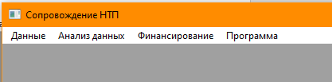

Рис. 4 Изначальный экран приложения при запуске.

- В подменю «**Данные**» входят ссылки на таблицы, в которых хранятся все основные данные. При нажатии отображаются сами таблицы.

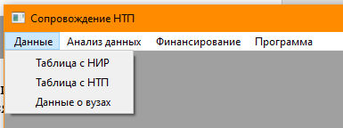

Рис. 5 Подменю «Данные».

- **Таблица с НИР** содержит данные о НИР а также реализует следующие функции:
  

Рис. 6 Отображение таблицы «Данные о НИР».

- Сортировка данных в таблице
- Добавление и редактирование записей 

Рис. 7 Пример редактрирования записи в таблице.

- Удаление записей.
- Фильтрация данных

Рис. 8 Всплывающее окно фильтрации данных таблицы.

- **Таблица с НТП** содержит данные о программах
  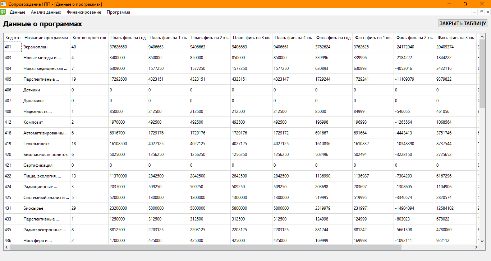

Рис. 9 Отображение таблицы «Данные о программах».

- **Данные о вузах**
  

Рис. 10 Отображение таблицы «Данные о вузах».

- В подменю «**Анализ данных**» входят отчётные формы.
  Пункты подменю активны только когда открыта таблица с НИР.

Рис. 11 Подменю «Анализ данных».

Пример отчетной формы

Рис. 12 Пример отчетной формы распределения НИР по вузам.

Доступна функция «Сохранить отчет»

- Подменю «Финансирование» позволяет выдать распоряжение о финансировании.

Рис. 13 Окно «Финансирование».

- Подменю «Программа» позволяет вывести справку, данные о самой программе, возможность закрытия программы.

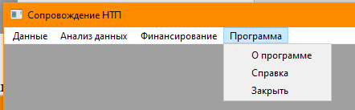

Рис. 14 Подменю «Программа».

## **Руководство администратора системы.**
**Состав продукта:** 

- Исполняемый файл **nir.exe.**
- Файлы с параметрами подключения к серверу MySQL **config.ini**
- Папка с файлами справки **doc/**

**Рекомендуемые системные требования.**

- Windows 7+
- 50 Мб свободного места на диске
- MySQL Server
  (Если предполагается развертывание базы данных на локальном компьютере)

**Развертывание программы.**

- Распаковать архив в папку на локальном компьютере. 
- При необходимости настроить параметры подключения в файле **config.ini**

[DB]

Host=localhost

User=root

Pass=root

DBName=nir

- Приложение запускается с помощью файла **nir.exe.**
- При отсутствии файла **config.ini,** он будет создан** с параметрами подключения по умолчанию при первом запуске программы.
- При отсутствии подключения программа запускается в offline-режиме без доступа к данным.
- Для корректной работы пункта меню *Справка* необходимо наличие в каталоге с исполняемым файлом папки **doc/**Результаты испытания системы.

## **Демонстрация работы программы**

Продемонстрируем работу программы на конкретном примере.

Установим следующие фильтры:

Федеральный округ = Центральный

Субъект = Москва

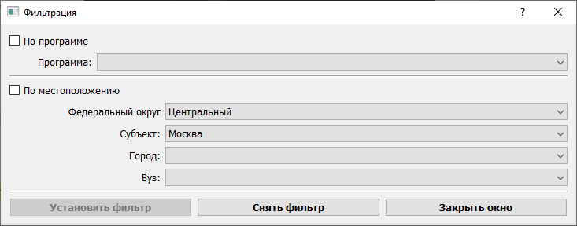

Рис. 15 Всплывающее окно «Фильтрация».

После установки фильтра открываем таблицы исходных данных:

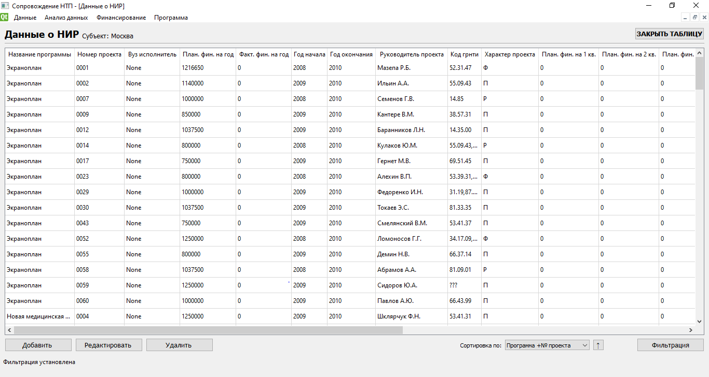

` `Рис. 16 Отфильтрованная по местоположению таблица «Данные о НИР».

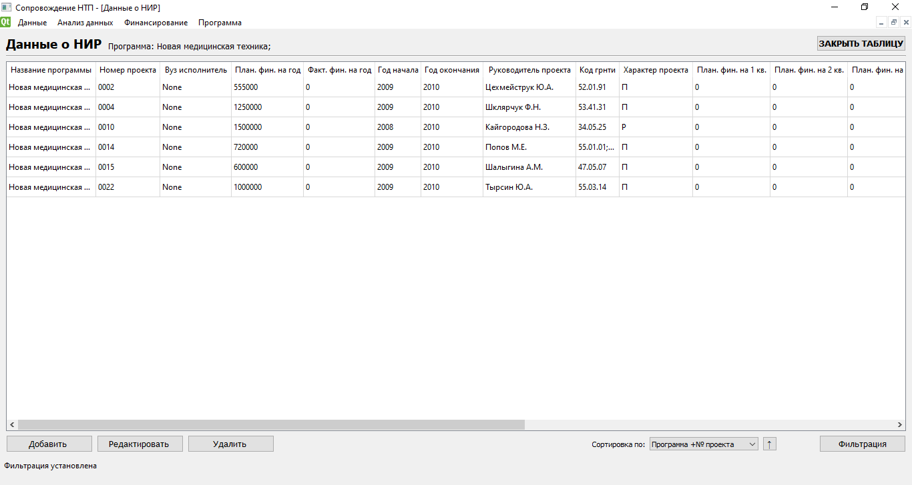

Рис. 17 Отфильтрованная по программе (Новая Медицинская Техника) таблица «Данные о НИР».

Далее добавим новую запись с помощью кнопки «Добавить»:

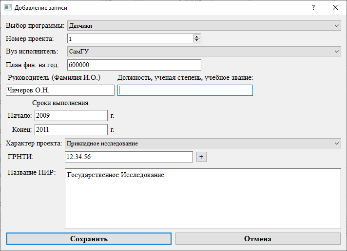

Рис. 18 Добавление новой записи для вуза СамГУ

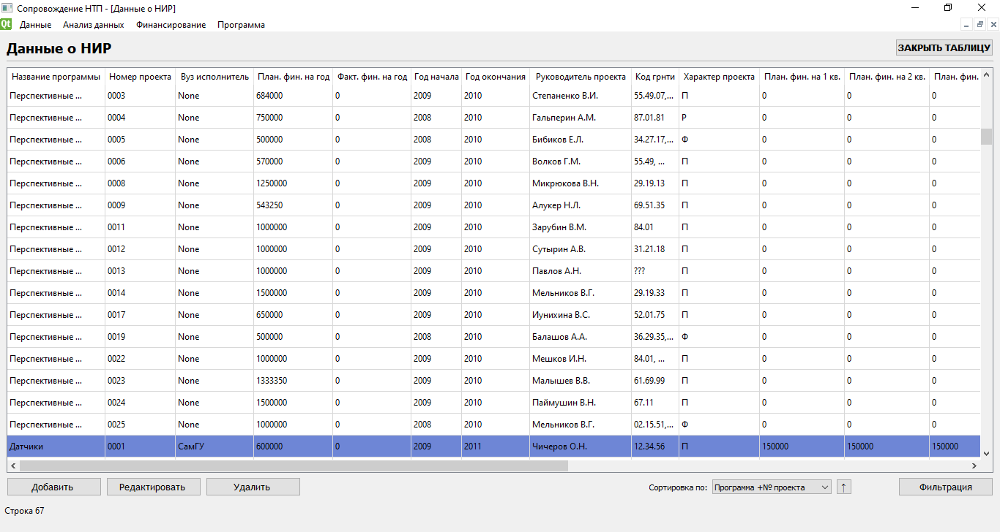

Рис. 19 Отображение новой записи выделенным цветом в основной таблице данных

Сохранение отчета анализа данных на примере характера НИР. Для этого воспользуемся кнопкой сохранить отчет.

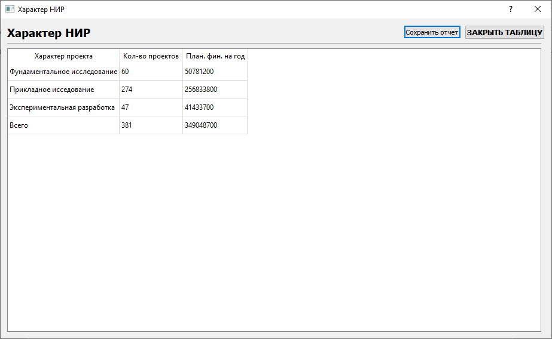

Рис. 20 Отображение анализа данных по характеру НИР

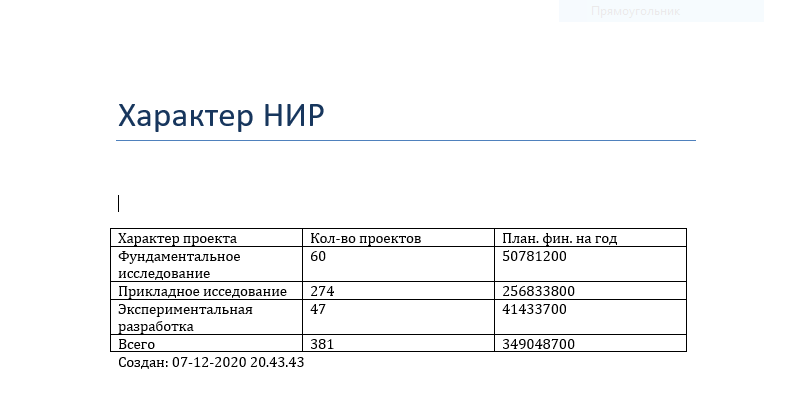

Рис. 21 Отображение отчета анализа данных по характеру НИР в WORD

Кнопка «Выдать распоряжение» на финансирование. Для этого выбираем квартал и вводим сумму.

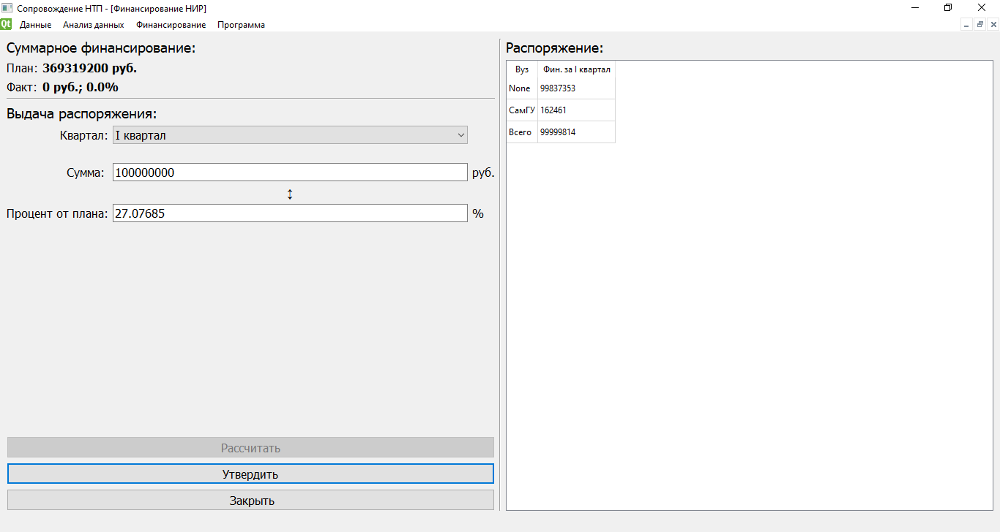

Рис. 22 Окно утверждения финансирования

# **Заключение** 
В результате проведенных испытаний было установлено, что все требуемые функции выполняются информационной системой в соответствии с заданным техническим заданием: вывод исходных таблиц, корректное проведение анализа данных, сортировка, добавление, удаление и редактирование записи, фильтрация данных.

# **Список использованных источников**  
- [https://python-scripts.com/pyqt5]()
- [https://doc.qt.io/qtforpython/]( )
- [https://dev.mysql.com/doc/]( )

